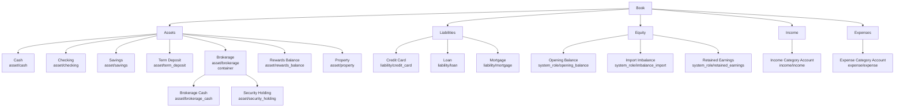

# Account Hierarchy

Rekenraam uses a double-entry chart of accounts. Accounts are ledger buckets
arranged in a tree. Postings always point to accounts; friendly concepts such as
categories, wrappers, and reports layer on top of those accounts.

The account model deliberately separates four ideas:

- `account_class`: the accounting class that drives signs, reports, and
  double-entry rules.
- `account_kind`: the account's behavioral and UI profile.
- `system_role`: the internal workflow role for seeded system accounts.
- Categories: user-facing income and expense reporting buckets backed by
  income or expense accounts.

## Classes

`account_class` is a fixed ledger invariant:

- `asset`: what the user owns or controls, including cash, bank accounts,
  brokerage positions, property, vehicles, receivables, and rewards balances.
- `liability`: what the user owes, including credit cards, credit lines, loans,
  mortgages, taxes payable, and other payables.
- `equity`: net-worth and balancing accounts, mostly system-owned in normal
  personal finance use.
- `income`: sources of value that increase net worth over a period.
- `expense`: uses of value that decrease net worth over a period.

Classes are not extensible by users. They are the reporting and double-entry
foundation.

## Kinds

`account_kind` is a catalog-backed profile. It tells the app which account UI,
validation hints, and future workflow controls fit an account. It is not the
place for income or expense categories, tax wrappers, country-specific pension
programs, or system workflow roles.

Initial built-in asset kinds:

- `cash`: physical cash or cash-like wallet balances.
- `checking`: transactional bank account.
- `savings`: liquid savings or reserve account.
- `term_deposit`: fixed-term savings, CD, or term deposit with maturity-related
  fields later.
- `brokerage`: investment container; usually `allows_postings=false` and holds
  child accounts.
- `brokerage_cash`: cash inside a brokerage or investment container.
- `security_holding`: one holding account for one security or commodity.
- `crypto_wallet`: crypto holding account or wallet.
- `property`: real estate or other large property tracked as an asset.
- `vehicle`: vehicle tracked as an asset.
- `rewards_balance`: points, miles, or other non-cash balances tracked as a
  commodity.
- `receivable`: money owed to the user.
- `other_asset`: fallback asset kind.

Initial built-in liability kinds:

- `credit_card`
- `line_of_credit`
- `loan`
- `mortgage`
- `tax_liability`
- `payable`
- `other_liability`

Initial built-in equity, income, and expense kinds:

- `equity`
- `income`
- `expense`

More detail belongs elsewhere:

- Salary, interest, dividends, groceries, fees, taxes, and similar reporting
  labels are categories backed by income or expense accounts.
- 401(k), ISA, RRSP, superannuation, pension, and similar country-specific
  account meanings are wrappers or tax treatments, not account kinds.
- Realized gains, unrealized gains, investment fees, and lots belong to the
  investment workflow layer once that layer exists.

## System Accounts

System accounts are ordinary accounts with `is_system=true`, `account_class`,
and `account_kind`, plus a stable `system_role`. They are hidden from normal
account lists unless the API caller explicitly asks for `include_system=true`.

Current system roles use `account_class=equity` and `account_kind=equity`:

- `opening_balance`
- `imbalance_import`
- `retained_earnings`
- `income_summary`
- `expense_summary`

The role, not the kind, identifies the workflow. System account labels come from
translation keys based on `system_role`.

## Tree Shape

Root accounts are usually class containers. User-postable accounts sit under the
class they belong to. Container accounts use `allows_postings=false`.

## Commodities

Accounts hold quantities of commodities. Money is a commodity, but so are
securities, crypto assets, points, miles, and other countable units. A rewards
balance is still an asset account; its non-monetary nature belongs to the
commodity, not to a new accounting class.
