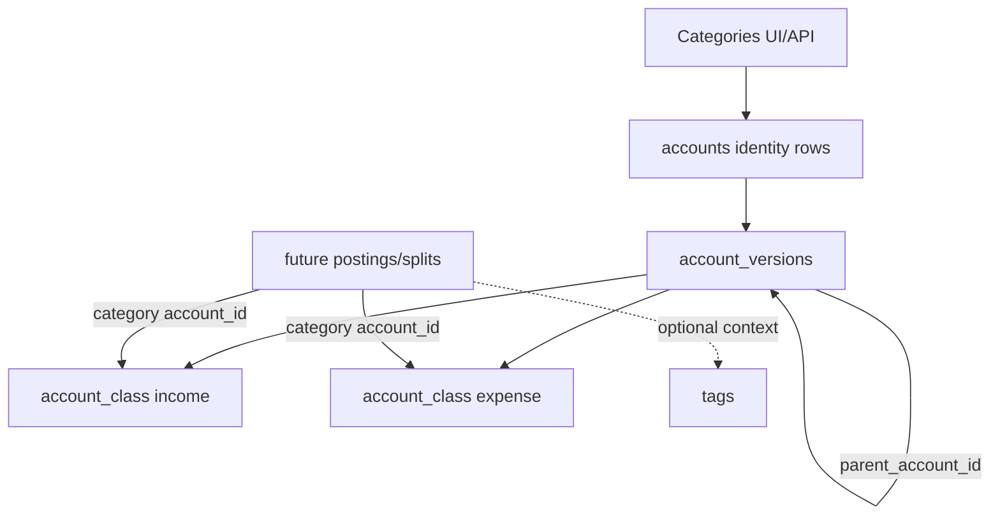

# Categories Design

Categories are the user-facing budgeting and reporting layer over income and
expense accounts. They are not a separate ledger primitive and do not get a
separate version table. This preserves double-entry accounting while keeping
the UI vocabulary familiar.

## Data Model

- A category is an account with `account_class = income` or `expense`.
- Category account kinds match their class: `account_kind = income` or
  `expense`.
- Category accounts are currency agnostic. They leave `default_commodity_id`
  null, so postings in different currencies can use the same category.
- Category hierarchy uses `account_versions.parent_account_id`.
- Category changes append `account_versions` rows. `effective_from` controls
  as-of reporting; audit events preserve who made the change and why.
- Built-ins use stable `code` values and metadata:
  - `metadata.category.type`
  - `metadata.category.is_builtin`
  - `metadata.category.builtin_key`
  - `metadata.category.name_override` when a built-in is renamed
- Built-in display labels are translated in the frontend. User-created category
  names and user overrides are stored as user text and are not translated.

## API

The category API is a constrained wrapper over the account tables:

- `GET /api/v1/categories`
- `POST /api/v1/categories`
- `GET /api/v1/categories/{category_id}`
- `PATCH /api/v1/categories/{category_id}`
- `POST /api/v1/categories/{category_id}/disable`
- `POST /api/v1/categories/{category_id}/restore`
- `DELETE /api/v1/categories/{category_id}`
- `POST /api/v1/setup/categories`

The wrapper rejects account-only fields such as institution, account number,
country, and default commodity. Parents must be categories of the same type.
Category type is immutable after creation.

## Lifecycle Rules

- Disable archives a category for active pickers while preserving history.
- Parent categories with active children cannot be disabled until children are
  disabled or moved.
- Built-in categories are never hard deleted. They can be renamed or disabled.
- User-created categories can be hard deleted only when they have no child
  categories and no financial references. Until transaction/posting tables
  exist, the delete policy helper treats categories as unused; it must be
  extended when postings are added.
- Duplicate active names are rejected among siblings in the same income or
  expense tree. The same label may exist under different parents.

## Categories Versus Tags

Categories answer "what kind of income or expense is this?" A split or posting
should choose one income or expense category.

Tags answer "what context does this belong to?" Tags can represent projects,
people, flags, places, hobbies, or custom groupings. A transaction or posting
may have multiple tags later, such as `Vacation Summer 2026`, `Alex`, and
`reimbursable`. Tag kind is mutable: changing a tag from `project` to `custom`,
for example, changes the grouping for every existing reference to that tag.

## Built-In Starter Set

Built-in parent groups normally have `allows_postings = false`. Leaf categories
normally have `allows_postings = true`.

Expense groups and leaves:

- Housing: Rent/Mortgage, Utilities, Home Maintenance, Home Supplies
- Food: Groceries, Dining Out, Coffee/Snacks
- Transport: Fuel, Public Transport, Taxi/Rideshare, Parking, Vehicle
  Maintenance
- Health: Medical, Pharmacy, Dental/Vision, Fitness
- Insurance: Health Insurance, Home/Renters Insurance, Vehicle Insurance, Life
  Insurance
- Family: Childcare, Education, Pets, Gifts
- Personal: Clothing, Personal Care, Subscriptions, Hobbies
- Travel: Flights, Hotels, Vacation Spending
- Financial: Bank Fees, Interest, Taxes
- Giving: Charity, Religious Giving
- Other Expense

Income categories:

- Salary/Wages
- Bonus
- Interest
- Dividends
- Business/Freelance
- Gifts Received
- Refunds/Reimbursements
- Other Income
